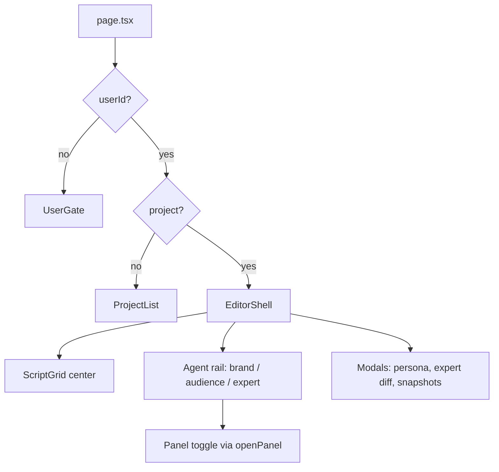

# Interaction Refactor (Frozen Sunlight)

Branch: `refactor/frozen-sunlight-interaction`  
Design source: [DESIGN.md](./DESIGN.md)

## Current interaction model (baseline on `main`)

- **Routing:** No URL routes; a single `page.tsx` switches views via Zustand (`userId`, `project`).
- **State:** Monolithic `appStore` holds editor, layout, brand, audience, expert, snapshots, and per-agent chat.
- **Editor:** `EditorShell.tsx` (~1.5k lines) owns save debounce, agent SSE, brand tabs, persona CRUD, expert diff overlay.
- **Visual:** Dark theme in `globals.css` (`color-scheme: dark`); not aligned with Frozen Sunlight.

## Refactor goals

1. **Design tokens** — Map DESIGN.md YAML to CSS variables (light glass surfaces, typography, spacing, sunlit shadows).
2. **Navigation shell** — Explicit app phases with optional Next.js routes: enter → hub → workspace.
3. **Interaction decomposition** — Split `EditorShell` into layout shell + agent panels + overlays; thin `page.tsx`.
4. **State boundaries** — Separate `sessionStore` (user/projects) from `workspaceStore` (script/editor/agents) to limit rerenders and clarify lifecycle.
5. **Agent rail UX** — Persistent workspace with glass panes; panel state as first-class (not only toggle); stale badges per DESIGN chips.

## Suggested implementation order

| Step | Scope | Notes |
|------|--------|--------|
| 1 | `globals.css` + fonts | Tokens from DESIGN frontmatter; remove dark-only palette |
| 2 | Primitives | Button, Input, Card, Chip, GlassPane |
| 3 | `UserGate` + `ProjectList` | Light glass layouts; margin grid |
| 4 | Workspace layout | Topbar + script grid + resizable agent column |
| 5 | Agent panels | Extract from EditorShell; keep API/store contracts stable |
| 6 | Overlays | Persona modal, expert diff, snapshots as portal/glass modals |

## Branch relationship

- This branch was created from **`main`** (through Phase 3 docs/features).
- Feature work on **`codex/phase-2-agent-infrastructure`** (Phase 4–5: audience, expert loop) is ahead; merge or rebase that branch when interaction shell is ready.

## Out of scope (for this refactor pass)

- Backend API changes
- LangGraph / agent logic
- Replacing Zustand with another state library (unless split stores only)
